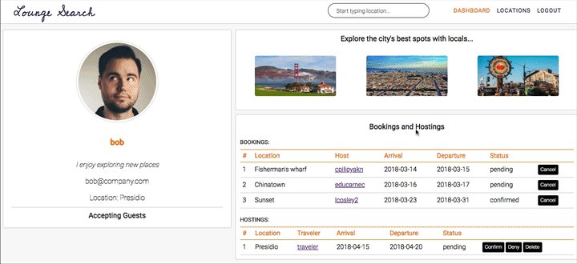
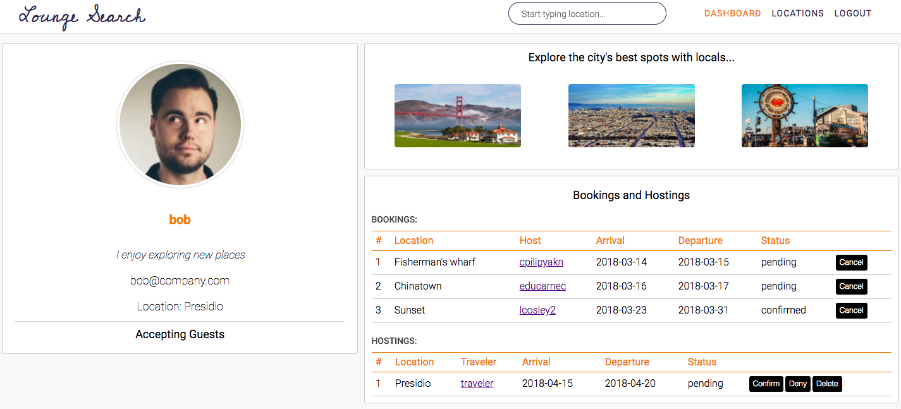
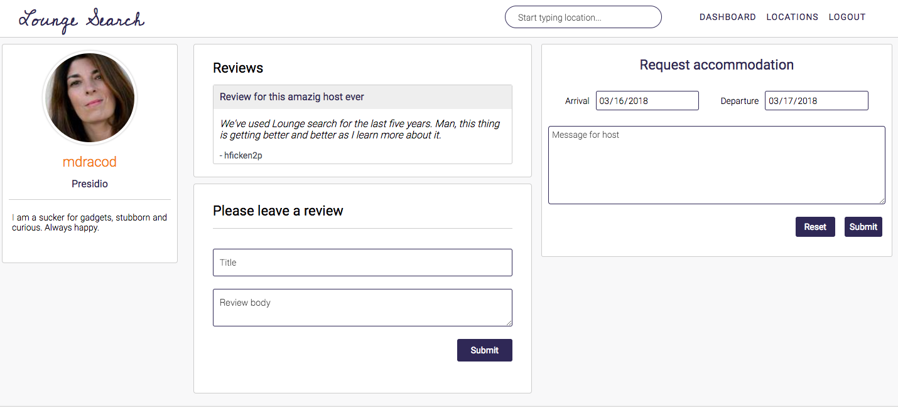

# Lounge search

https://lounge-search.herokuapp.com/

Lounge Search is a free lodging website inspired by CouchSurfing. 
The site was created for travelers who want to explore the various spots of San Francisco, 
and stay with locals who know the area.
 
It utilizes React/Redux frameworks on frontend and Rails/PostgresSQL on backend.
The whole project was designed and developed within two weeks.
There are still plenty of new features to be implemented, so I'm planning to continue making improvements in the future.

### Features
* Secure user authentication in both the frontend and the backend using BCrypt.
* Users can view and available locations within San Francisco, CA and identify hosts related to a specific location.
* Users can search for locations typing in the search field.
* The application dynamically adapts the page view to display all information in a beautiful way.
* Users can create bookings by requesting hosts for accommodation while hosts have an ability to confirm or deny the request.
* Users can create reviews for other users and view reviews associated with other users.

### User authentication
The user authentication is based on BCrypt hashing technology which remains resistant to brute-force search attacks even with increasing computation power. Therefore, there is a assurance to protect users' credentials information even when the log-in session is stored on the browser.


### Search

The search bar in the header section enables users to traverse the application with ease as the tool uses input characters to find any relevant location.  
The results of a search are sorted alphabetically, and separated by area.
The placement of the feature makes it available throughout the user experience; thus, making it a valuable asset to any LoungeSearcher. 



This feature builds on its functionality in the show page for a particular neighborhood.  
As there may be hundreds of hosts in a particular area, it it can be difficult to find someone who meets your distinct needs.  

This was accomplished by building few React components on frontend and the search function in the backend of the location models

```javascript
Frontend
...
class Search extends React.Component {
handleSubmit(e) {
  e.preventDefault();
  this.props.searchLocations(this.state.searchTerm).then(
    () => this.props.history.push('/search')
  );
}


render() {
  return (
    <form onSubmit={this.handleSubmit}>
    <input type="search" value=""
      onChange={this.update('searchTerm')}
      onSubmit={this.handleSubmit}
      value={this.state.searchTerm}
      placeholder="Start typing location..." />
    </form>
  );
}
}
...
class locationSearchResults extends React.Component {
  render(){
    let locations = this.props.locations;
    let message;
    let locationItems;
    if (locations.length > 0){
      message = '';
      locationItems = locations.map( location =>(
        <LocatonIndexItem key={location.id} location={location} />
      ));
    } else {
      message = 'No results found';
      locationItems = <div></div>;
    }
  return(
    <div className='row location-background'>
      <h1 className='location-slogan'>{ message }</h1>
        <div className='locations'>
          <ul>
            {locationItems}
          </ul>
        </div>
    </div>
  );    
  }
}
```
 
This function was built using the PostgresSQL.

```ruby
...
# Backend
    def self.search(term)
       Location.where("area ILIKE :term", term: "%#{term}%")
    end 
...    
```    
### Dashboard
The dashboard style is optimized and minimalist in a way to not overwhelm the user.  
The dashboard feature is dynamic and it offers the user the different functionality available to Users
 throughout the application. It enables the user to see bio information, view status of the bookings, 
 confirm or deny accommodation requests from other users, and  see most attractive spots in San Francisco.



This is related to various requests to the backend:

```javascript
..
const mapDispatchToProps = dispatch => ({
  fetchUser: (id) => dispatch(fetchUser(id)), 
  fetchBookings: () => dispatch(fetchBookings()),
  deleteBooking: id => dispatch(deleteBooking(id)),
  updateBooking: booking => dispatch(updateBooking(booking)),
});
..
```
One of the complexities was to split backend response related to bookings 
into two parts: the first bookings only - where current user is represented as a traveller
the second where current user is represented as a host.

```javascript
// it was done inside the dashboard React container by filtering
// Redux state with currentUser.id
..
const mapStateToProps = state => {
  let currentUserId = state.session.currentUser.id;
  return (
    {
      bookings: Object.values(state.bookings).filter(element =>{
        return element.traveler_id === state.session.currentUser.id;
      }),
      hostings: Object.values(state.bookings).filter(element =>{
        return element.host_id === state.session.currentUser.id;
      }),
    }
  );
};
...
```

### Reviews
Users can create reviews for other users and view reviews associated with other users.
This feature is intended to show positive and negative feedback related to travelers' experience
staying with the hosts.



It was implemented using ActiveRecord association on backend and including all necessary 
information into user.show payload

```ruby
# Backend
...
class User < ApplicationRecord
  
  has_many :reviews,
    primary_key: :id,
    foreign_key: :user_id,
    class_name: :Review
...

```
```jbuilder
json.reviews do
  
  json.array! @user.reviews do |review|
    json.id review.id
    json.user_id review.user_id
    json.title review.title
    json.body review.body
      if !review.author.nil?
        json.author_name review.author.username
      else
        json.author_name 'noname'
      end    
  end
end    
```  

```javascript
...
const mapDispatchToProps = dispatch => ({
  fetchUser: id => dispatch(fetchUser(id)),
  createBooking: booking => dispatch(createBooking(booking)),
});
...
```


```javascript
..
const mapDispatchToProps = dispatch => ({
  fetchUser: id => dispatch(fetchUser(id)),
  createBooking: booking => dispatch(createBooking(booking)),
});
..
```


## Project Design

LoungeSearch has a clean design with minimalism and functionality as its primary intentions. 
The site also let the user explore the city of San Francisco.  Keeping code functional is prioritized as the timeframe for production was limited to two weeks.  Smooth, bug-free navigation is imperative to this site's success.  

There are several pages (i.e. the locations index page) that rely on the beauty of the city for the elegance of the site, while the show location page for the specific spot encourages the user to view different hosts pages 
to check their bio and other information.

## Technologies

Rails is used for this site due to its support for relational databases and RESTful architecture.  The offered the functionality needed for an application built with such haste.  This project is meant as a portfolio piece; thus, the technologies were chosen to be adequate for the work load.

Frontend Redux states are set up in a way such that there are separate reducers and actions for locations, bookings, dashboard, search, users, headers, and footers, and errors. This normalizes the state, easing the task of keeping things up-to-date with changes in the database.

## Possible Future Features/Updates

* User to edit/delete reviews
* User to edit their bio and profile
* User to update/ bookings and check out message submitted for host
* Styling improvements and optimization across all pages
* CSS code optimization to follow "DRY" style
* Add search functionality to search for users
