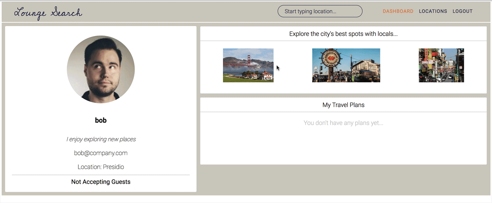

# Lounge search

https://lounge-search.herokuapp.com/

LoungSearch is a free lodging website for those who want to explore the various spots of San Francisco, 
with locals who know the area, inspired by CouchSurfing. 
It utilizes React/Redux frameworks on frontend and Rails/PostgresSQL on backend.
The whole project was designed and developed within two weeks.
There are still plenty of new features to be implemented, so I'm planning to continue making improvements in the future.

### Features
* Secure user authentication in both the frontend and the backend using BCrypt.
* Users can view available locations within San Francisco, CA and identify hosts to related to a specific location.
* The application dynamically adapts the page view to display all information in a beautiful way.
* Users can search for locations typing in the search field.
* Users can create and view reviews for other users.

### Search

The search bar in the header section enables users to traverse the application with ease as the tool uses input characters to find any relevant location.  
The results of a search are sorted alphabetically, and separated by area.
The placement of the feature makes it available throughout the user experience; thus, making it a valuable asset to any LoungeSearcher. 



This feature builds on its functionality in the show page for a particular neighborhood.  
As there may be hundreds of hosts in a particular area, it it can be difficult to find someone who meets your distinct needs.  

This was accomplished by building a search function in the backend of the location models.  
This function was built using the PostgresSQL.

```ruby
    def self.search(term)
       Location.where("area ILIKE :term", term: "%#{term}%")
    end 
```    
### Dashboard

The dashboard feature is dynamic and it offers the user the different functionality available to Users
 throughout the application. It enables the user to see bio information, see most attractive spots in 
 San Francisco and have access to different menu options available in the top menu.
